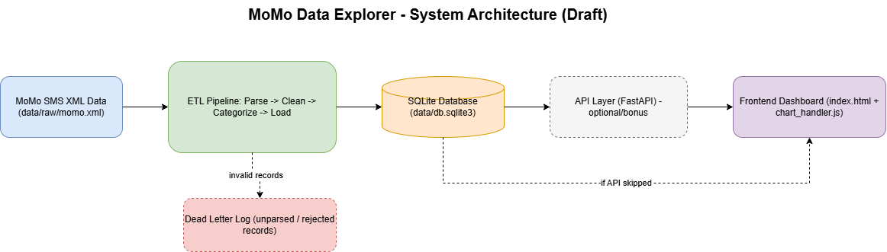

# Urban Mobility Data Explorer — MoMo SMS ETL & Dashboard

Week 1 deliverable: team setup and project planning for the Enterprise Web
Development summative. This project ingests Mobile Money (MoMo) SMS data
(XML), cleans and categorizes it into a relational database, and serves it
through a frontend dashboard.

## Team Name

_TBD_

## Project Description

This project builds an ETL pipeline and dashboard for MoMo SMS transaction
data as the foundation for the **Urban Mobility Data Explorer** summative
project. Raw XML SMS exports are parsed, cleaned/normalized, categorized by
transaction type, and loaded into a relational database. A lightweight
frontend dashboard visualizes the processed data.

## Team Members

| Name | Role | GitHub |
| --- | --- | --- |
| Orion Kabeza | Team Lead & ETL (parsing) | [orionkabeza](https://github.com/orionkabeza) |
| Mpamira Ntwali Djibril | ETL (cleaning & categorization) | [dmpamira-debug](https://github.com/dmpamira-debug) |
| Emmanuel Happy Rangira | Database & Backend API | [erangira-005](https://github.com/erangira-005) |
| kmaster-alt | Frontend Dashboard | [kmaster-alt](https://github.com/kmaster-alt) |
| aubin_00 | Architecture & Scrum Board | [zotyall](https://github.com/zotyall) |

## Week 1 Task Assignments

| Task | Owner | Status |
| --- | --- | --- |
| Repo setup & invite collaborators | Orion Kabeza | Done |
| Project directory scaffold | Orion Kabeza | Done |
| README (team, description, links) | Orion Kabeza | In Progress |
| System architecture diagram (draw.io/Miro) | aubin_00 | To Do |
| Scrum board setup (GitHub Projects/Trello/Jira) | aubin_00 | Done |
| XML parsing (`etl/parse_xml.py`, `tests/test_parse_xml.py`) | Orion Kabeza | To Do |
| Cleaning & normalization (`etl/clean_normalize.py`, `tests/test_clean_normalize.py`) | Mpamira Ntwali Djibril | To Do |
| Categorization rules (`etl/categorize.py`, `tests/test_categorize.py`) | Mpamira Ntwali Djibril | To Do |
| DB schema & loader (`etl/load_db.py`) | Emmanuel Happy Rangira | To Do |
| Backend API (`api/app.py`, `api/db.py`, `api/schemas.py`) | Emmanuel Happy Rangira | To Do |
| Frontend dashboard (`index.html`, `web/`) | kmaster-alt | To Do |

## Setup & Run Instructions

```bash
# 1. Clone the repo and enter it
git clone https://github.com/orionkabeza/urban-mobility-data-explorer.git
cd urban-mobility-data-explorer

# 2. Create and activate a virtual environment
python3 -m venv venv
source venv/bin/activate

# 3. Install dependencies
pip install -r requirements.txt

# 4. Copy the environment template and fill in real values
cp .env.example .env

# 5. Run the ETL pipeline
./scripts/run_etl.sh

# 6. Serve the frontend dashboard
./scripts/serve_frontend.sh
```

_Instructions will be filled in as each stage (ETL, API, frontend) is
implemented._

## Architecture Diagram



The pipeline: `MoMo SMS XML` -> ETL (`parse -> clean -> categorize -> load`) -> `SQLite DB`, with invalid records routed to a dead-letter log. The API layer (FastAPI) is optional/bonus; the frontend dashboard reads either from the API or directly from the processed data if the API is skipped.

## Scrum Board

[Trello board](https://trello.com/b/gDQLVtpx/enterprise-web-dev-momo-data-explorer)
