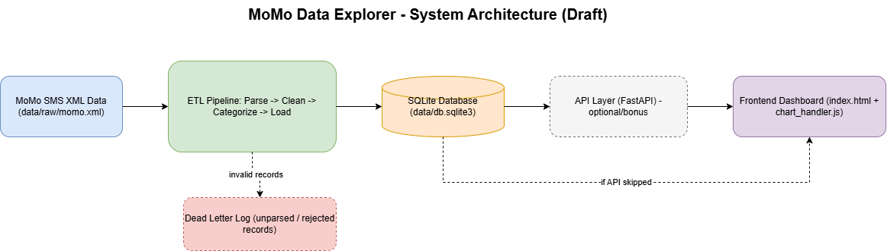

# Urban Mobility Data Explorer — MoMo SMS ETL & Dashboard

Week 1-2 deliverables for the Enterprise Web Development summative. This
project ingests Mobile Money (MoMo) SMS data (XML), cleans and categorizes
it into a relational database, and serves it through a frontend dashboard.

## Team Name

_TBD_

## Project Description

This project is built around processing MoMo SMS transaction data that comes in XML format.

The data goes through an ETL pipeline where it is parsed, cleaned, normalized, and sorted into different transaction categories before being stored in a relational database.

Once the data is ready, a lightweight frontend dashboard is used to display and visualize it in a meaningful way. This serves as the foundation for the larger **Urban Mobility Data Explorer project.**

## Team Members

| Name | Role | GitHub |
| --- | --- | --- |
| Orion Kabeza | Team Lead & ETL (parsing) | [orionkabeza](https://github.com/orionkabeza) |
| Mpamira Ntwali Djibril | ETL (cleaning & categorization) | [dmpamira-debug](https://github.com/dmpamira-debug) |
| Emmanuel Happy Rangira | Database & Backend API | [erangira-005](https://github.com/erangira-005) |
| kmaster-alt | Frontend Dashboard | [kmaster-alt](https://github.com/kmaster-alt) |
| aubin_00 | Architecture & Scrum Board | [zotyall](https://github.com/zotyall) |

## Week 1 Task Assignments

| Task | Owner | Status |
| --- | --- | --- |
| Repo setup & invite collaborators | Orion Kabeza | Done |
| Project directory scaffold | Orion Kabeza | Done |
| README (team, description, links) | Orion Kabeza | Done |
| System architecture diagram (draw.io/Miro) | aubin_00 | Done |
| Scrum board setup (GitHub Projects/Trello/Jira) | aubin_00 | Done |
| XML parsing (`etl/parse_xml.py`, `tests/test_parse_xml.py`) | Orion Kabeza | Done |
| Cleaning & normalization (`etl/clean_normalize.py`, `tests/test_clean_normalize.py`) | Mpamira Ntwali Djibril | Done |
| Categorization rules (`etl/categorize.py`, `tests/test_categorize.py`) | Mpamira Ntwali Djibril | Done |
| DB schema & loader (`etl/load_db.py`) | Emmanuel Happy Rangira | Done |
| Backend API (`api/app.py`, `api/db.py`, `api/schemas.py`) | Emmanuel Happy Rangira | Done |
| Frontend dashboard (`index.html`, `web/`) | kmaster-alt | Done |

## Week 2 Task Assignments

Orion drafted a full working schema as a starting point so the team could
see the whole design at once; each owner below then made their own real
schema improvement and committed it individually (see `git log` for
per-author commits, and each merged PR on GitHub) so individual marks are
backed by real, attributable contributions:

| Task | Owner | Status |
| --- | --- | --- |
| `sms_messages` table (DDL, indexes, sample data) | Orion Kabeza | Done |
| ERD render, design doc, MySQL 8.0 verification screenshots, final integration merging all branches into `main` | Orion Kabeza | Done |
| `transactions` + `transaction_participants` tables — self-reversal CHECK constraint + lookup indexes ([PR #1](pull/1)) | Emmanuel Happy Rangira | Done |
| `users` table + `examples/json_schemas.json` — 2 new users from source SMS data + paginated user-list example ([PR #2](pull/2)) | Kenneth Master | Done |
| `transaction_categories` table — `is_active` column; ERD rebuilt in draw.io with full crow's-foot notation | Mfura Axel Aubin | Done ([erd_diagram.png](docs/erd_diagram.png) updated; see note below) |
| `system_logs` table — `run_id` tracing column + dead-letter integrity CHECK ([PR #3](pull/3)) | Mpamira Ntwali Djibril | Done |

All four PRs merged into `main`; the combined `database/database_setup.sql`
has been re-validated end-to-end after merging (schema executes cleanly,
all FK/CHECK constraints and the `transaction_participants` M:N junction
still resolve correctly).

**Known follow-up (not blocking):** `docs/erd_diagram.drawio` (the editable
source) wasn't updated alongside the new `docs/erd_diagram.png` — the PNG
was re-exported from a rebuilt diagram, but the `.drawio` file in the repo
still reflects the earlier version. It's a good source-of-truth diagram, so
worth reconciling before final submission. Also a couple of minor labels
in the new PNG are worth a quick pass: `discription` → `description`,
`reverse_transaction_id` → `reverses_transaction_id` (matches the actual
column name), and the `transaction_participants` box shows `user_id`
listed twice where the fourth field should read `role`.

## Database Design (Week 2)

The database schema was reverse-engineered directly from `data/raw/momo.xml`
(11 distinct SMS message shapes: incoming money, payment to code holder,
bank deposit, transfer to mobile number, airtime/cash power/bundle bill
payments, third-party debits, agent withdrawals, failures, and reversals).

- **ERD**: [`docs/erd_diagram.png`](docs/erd_diagram.png) (image) /
  [`docs/erd_diagram.drawio`](docs/erd_diagram.drawio) (editable source —
  open at [app.diagrams.net](https://app.diagrams.net))
- **SQL schema**: [`database/database_setup.sql`](database/database_setup.sql)
  — MySQL 8.0 DDL (6 tables, FK/CHECK constraints, indexes) + sample DML
- **JSON serialization examples**: [`examples/json_schemas.json`](examples/json_schemas.json)
- **Full design doc** (rationale, data dictionary, verified queries,
  constraint-violation screenshots run against real MySQL 8.0):
  [`docs/database_design.md`](docs/database_design.md)

Six entities: `users`, `transaction_categories`, `sms_messages`,
`transactions`, `transaction_participants` (the many-to-many junction
resolving `users` ↔ `transactions`), and `system_logs` (ETL audit trail).

## Week 3 — Building and Securing a REST API

Canvas deliverable, due 2026-09-30. Uses a new dataset
(`data/raw/modified_sms_v2.xml`, 1,691 SMS records — gitignored like
`momo.xml`, each teammate needs their own copy) and a different stack than
Weeks 1-2: a **plain Python `http.server`** REST API (no FastAPI/Flask) over
**in-memory storage**, not the MySQL schema from Week 2.

| Task | Owner | File(s) | Status |
| --- | --- | --- | --- |
| Data Parsing (XML → JSON) | Orion Kabeza | `dsa/parse_sms.py`, `dsa/storage.py` | Done |
| API CRUD Endpoints | Emmanuel Happy Rangira | `api/app.py` | Skeleton ready — routing/CRUD wired, auth hook pending |
| Auth & Security (Basic Auth, 401, weakness write-up) | Emmanuel Happy Rangira | `api/auth.py` | TODO — see file |
| API Documentation | Kenneth Master | `docs/api_docs.md` | Skeleton ready — needs real screenshots once auth is done |
| DSA Integration (linear search vs. dict lookup, benchmark, reflection) | Mpamira Ntwali Djibril | `dsa/search_benchmark.py` | TODO — see file |
| Testing & Validation (curl/Postman screenshots) | Mfura Axel Aubin | `screenshots/` | TODO — see `screenshots/README.md` |

1,682 of 1,691 records parse cleanly into transactions (8 OTP messages are
correctly excluded as non-transactional, 1 malformed record goes to
`data/processed/dead_letter_sms.json`).

Run the API locally:
```bash
python3 -m dsa.parse_sms      # (re)generates data/processed/transactions.json
python3 -m api.app            # serves http://localhost:8000, Basic Auth required
```

Deliverables outside this repo: the team participation sheet (team lead
only — Orion) and the PDF report (security intro, endpoint docs, DSA
comparison, Basic Auth reflection).

## Setup & Run Instructions

```bash
# 1. Clone the repo and enter it
git clone https://github.com/orionkabeza/urban-mobility-data-explorer.git
cd urban-mobility-data-explorer

# 2. Create and activate a virtual environment
python3 -m venv venv
source venv/bin/activate

# 3. Install dependencies
pip install -r requirements.txt

# 4. Copy the environment template and fill in real values
cp .env.example .env

# 5. Run the ETL pipeline
./scripts/run_etl.sh

# 6. Serve the frontend dashboard
./scripts/serve_frontend.sh

# 7. Run the Week 3 REST API (see "Week 3" section above)
python3 -m dsa.parse_sms
python3 -m api.app
```

_Instructions will be filled in as each stage (ETL, API, frontend) is
implemented._

## Architecture Diagram



The pipeline: `MoMo SMS XML` -> ETL (`parse -> clean -> categorize -> load`) -> `SQLite DB`, with invalid records routed to a dead-letter log. The API layer (FastAPI) is optional/bonus; the frontend dashboard reads either from the API or directly from the processed data if the API is skipped.

## Scrum Board

[Trello board](https://trello.com/invite/b/6a9b871ca635a4268f44d10d/ATTIeac71249d169effb450ef9518f18446385DF072A/my-trello-board)

## Team Tasksheet
(https://docs.google.com/spreadsheets/d/1ZiOrJJSOua5e3nN7Ptt-UnA9-tS7xbbK1Fa_8zxyBb8/edit?usp=sharing)
