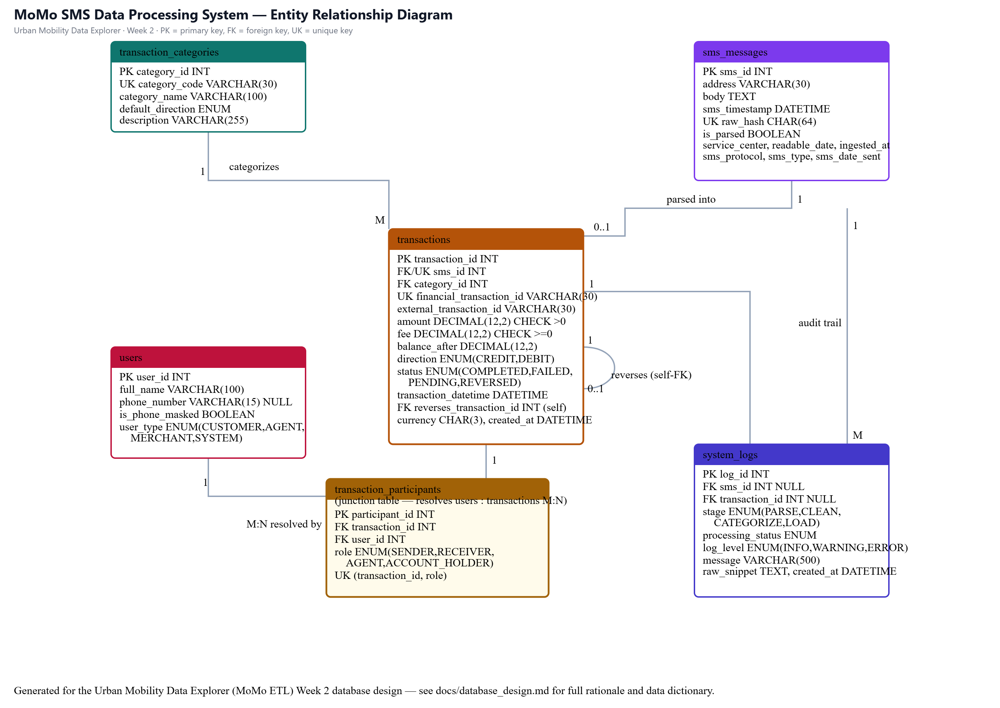
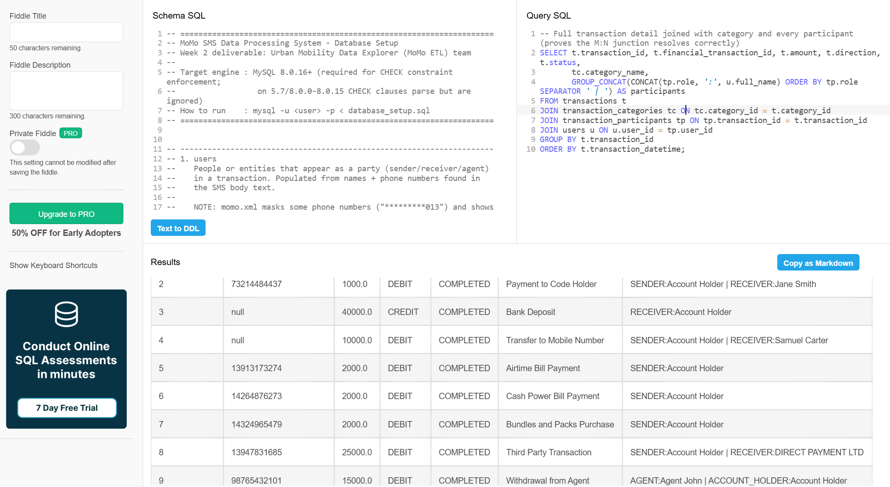
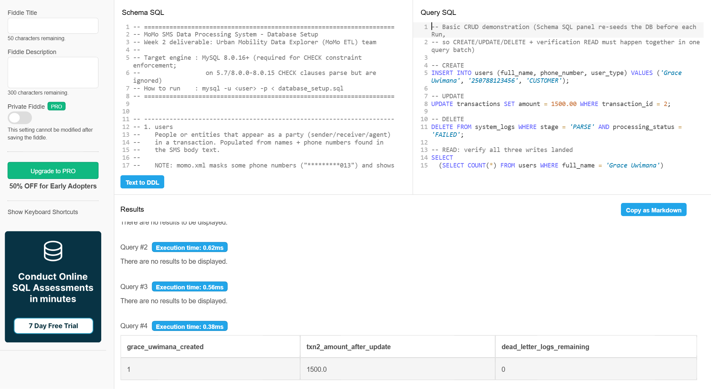
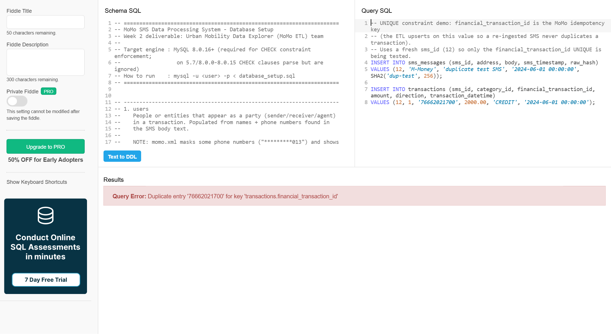
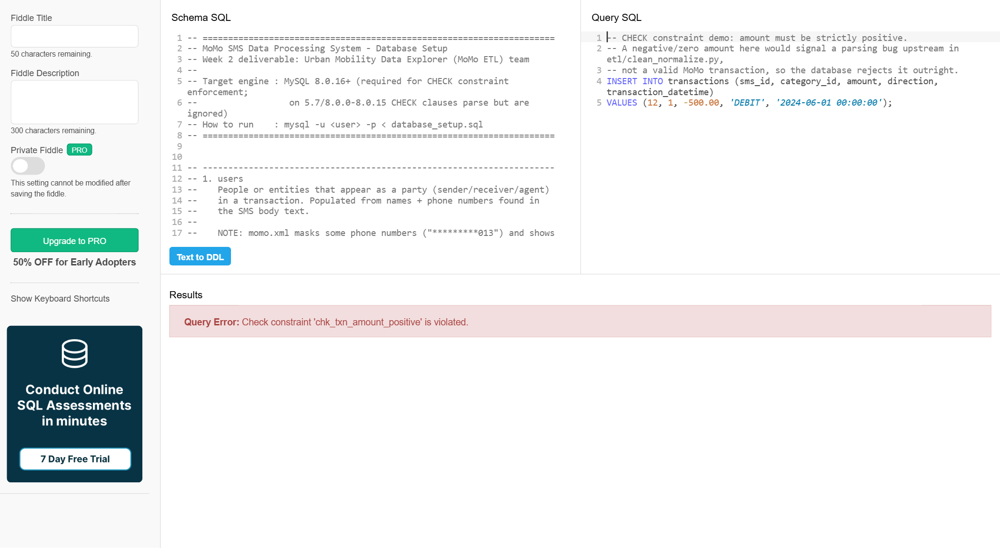
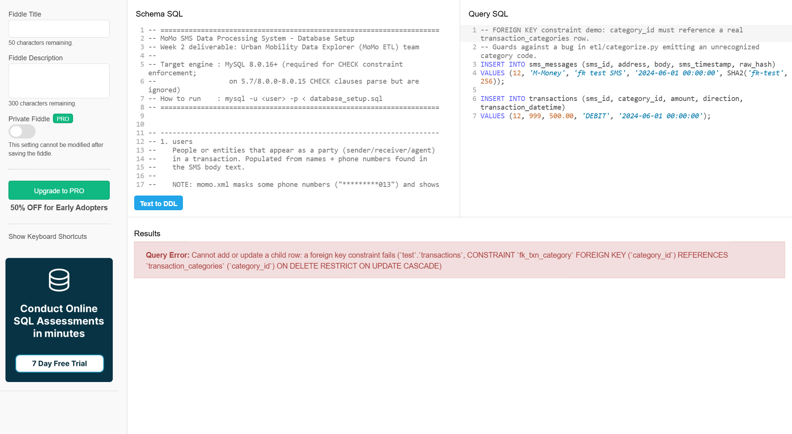
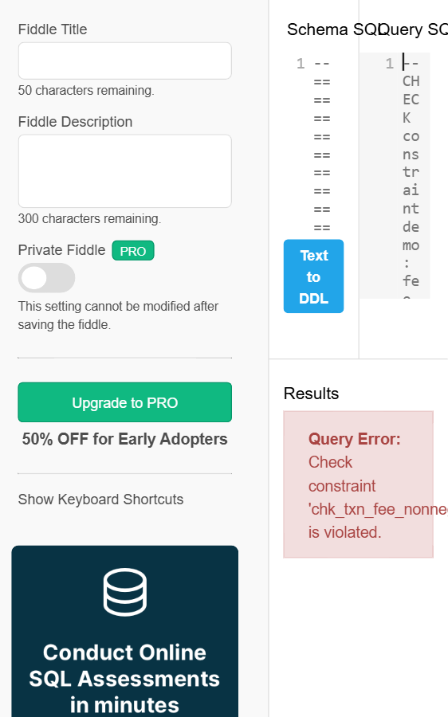

# Database Design Document — MoMo SMS Data Processing System

Week 2 deliverable · Urban Mobility Data Explorer (MoMo ETL) team

- ERD source (editable): [`erd_diagram.drawio`](erd_diagram.drawio) — open at [app.diagrams.net](https://app.diagrams.net)
- ERD image: [`erd_diagram.png`](erd_diagram.png)
- SQL implementation: [`../database/database_setup.sql`](../database/database_setup.sql)
- JSON serialization examples: [`../examples/json_schemas.json`](../examples/json_schemas.json)

---

## 1. Entity Relationship Diagram



Six entities: `users`, `transaction_categories`, `sms_messages`, `transactions`, `transaction_participants`, `system_logs`.

| Relationship | Cardinality | Notes |
|---|---|---|
| `transaction_categories` → `transactions` | 1:M | Every transaction has exactly one category |
| `sms_messages` → `transactions` | 1:0..1 | A message parses into at most one transaction (`sms_id` is `UNIQUE` on `transactions`) |
| `transactions` → `transaction_participants` | 1:M | A transaction has 1-3 participant rows |
| `users` → `transaction_participants` | 1:M | A user participates in many transactions over time |
| **`users` ↔ `transactions`** | **M:N**, resolved by `transaction_participants` | See §2 |
| `transactions` → `transactions` (self) | 1:0..1 | `reverses_transaction_id`, set only when `status = REVERSED` |
| `sms_messages` / `transactions` → `system_logs` | 1:M | ETL audit trail, both FKs nullable |

## 2. Design Rationale (why the schema looks like this)

The schema was derived directly from `data/raw/momo.xml`, not from a generic template — every design decision below traces back to a specific message pattern found in that file.

**Why a junction table instead of `sender_id`/`receiver_id` columns.** The eleven distinct SMS shapes in the data don't all describe a simple two-party transfer. A bank deposit names no counterparty at all; a merchant payment names one; a peer transfer names one; and an **agent withdrawal** ("*You Account Holder... have via agent: Agent John (...), withdrawn...*") names two — the account holder and the agent — for a single transaction. Two fixed FK columns can't represent that variability cleanly, so `transaction_participants` resolves `users`↔`transactions` as a real many-to-many relationship, with a `role` (`SENDER`/`RECEIVER`/`AGENT`/`ACCOUNT_HOLDER`) on each edge. This is the required M:N relationship, and it is evidenced by the source data rather than added just to satisfy the rubric.

**Why `phone_number` is nullable and not unique.** The same real-world contact appears both masked (`*********013`) and in full (`250791666666`) across different messages, and bank deposits carry only a settlement account number, not a phone number. A `UNIQUE` constraint on phone would break the first time a masked and unmasked number collided or a deposit arrived with no number at all, so `users` uses a surrogate `user_id` and treats phone as an informational, best-effort field.

**Why `status` and the self-referencing `reverses_transaction_id`.** The corpus contains not just completed transactions but explicit failures ("*...has failed at...*") and reversals ("*A reversal has been initiated...*"). Modeling only "happy path" transactions would silently drop real data the ETL pipeline has to handle, so `status` is a first-class `ENUM` and reversals link back to the original transaction via a nullable self-FK rather than a separate table.

**Why `sms_messages` is a separate table from `transactions`.** Keeping the raw SMS verbatim (1:1 with its parsed transaction via a `UNIQUE` FK) preserves an audit trail back to the original text and lets `system_logs` record processing outcomes — including dead-letter entries — for messages that never produce a transaction at all (`transaction_id` is nullable there for exactly that reason).

**Why `financial_transaction_id` is `UNIQUE` but nullable.** It is MoMo's own transaction identifier (`TxId` / "Financial Transaction Id" in the SMS body) and doubles as the ETL's idempotency key — re-ingesting the same backup file must not create duplicate rows. It's nullable because a handful of message types (bank deposits, mobile transfers) don't surface one.

## 3. Data Dictionary

### `users`
| Column | Type | Constraints | Description |
|---|---|---|---|
| user_id | INT | PK, AUTO_INCREMENT | Surrogate key |
| full_name | VARCHAR(100) | NOT NULL | Name as it appears in the SMS body |
| phone_number | VARCHAR(15) | NULL | May be masked (`*********013`), full, or absent |
| is_phone_masked | BOOLEAN | NOT NULL, DEFAULT FALSE | True when `phone_number` contains `*` characters |
| user_type | ENUM | NOT NULL, DEFAULT 'CUSTOMER' | CUSTOMER / AGENT / MERCHANT / SYSTEM |
| created_at, updated_at | DATETIME | NOT NULL | Row bookkeeping |

### `transaction_categories`
| Column | Type | Constraints | Description |
|---|---|---|---|
| category_id | INT | PK, AUTO_INCREMENT | Surrogate key |
| category_code | VARCHAR(30) | NOT NULL, UNIQUE | Stable key used by `etl/categorize.py` |
| category_name | VARCHAR(100) | NOT NULL | Dashboard label |
| description | VARCHAR(255) | NULL | |
| default_direction | ENUM('CREDIT','DEBIT') | NOT NULL | Typical balance effect |

### `sms_messages`
| Column | Type | Constraints | Description |
|---|---|---|---|
| sms_id | INT | PK, AUTO_INCREMENT | Surrogate key |
| address | VARCHAR(30) | NOT NULL | e.g. "M-Money" |
| body | TEXT | NOT NULL | Raw, unparsed SMS text |
| sms_timestamp | DATETIME | NOT NULL | Parsed from the `date` epoch-ms attribute |
| raw_hash | CHAR(64) | NOT NULL, UNIQUE | SHA-256 of the raw element; de-dupes re-ingested backups |
| is_parsed | BOOLEAN | NOT NULL, DEFAULT FALSE | Set once a `transactions` row exists |
| service_center, readable_date, sms_protocol, sms_type, sms_date_sent, ingested_at | — | NULL | Secondary/debug fields carried from the XML |

### `transactions`
| Column | Type | Constraints | Description |
|---|---|---|---|
| transaction_id | INT | PK, AUTO_INCREMENT | Surrogate key |
| sms_id | INT | FK → sms_messages, UNIQUE, NOT NULL | 1:1 provenance link |
| category_id | INT | FK → transaction_categories, NOT NULL | |
| financial_transaction_id | VARCHAR(30) | UNIQUE, NULL | MoMo's own TxId; ETL idempotency key |
| external_transaction_id | VARCHAR(30) | NULL | Present on some third-party debits |
| amount | DECIMAL(12,2) | NOT NULL, CHECK (amount > 0) | |
| fee | DECIMAL(12,2) | NOT NULL, DEFAULT 0, CHECK (fee >= 0) | |
| balance_after | DECIMAL(12,2) | NULL, CHECK (balance_after >= 0) | Not every message reports it |
| currency | CHAR(3) | NOT NULL, DEFAULT 'RWF' | |
| direction | ENUM('CREDIT','DEBIT') | NOT NULL | |
| status | ENUM('COMPLETED','FAILED','PENDING','REVERSED') | NOT NULL, DEFAULT 'COMPLETED' | |
| transaction_datetime | DATETIME | NOT NULL | Timestamp embedded in the SMS text |
| reverses_transaction_id | INT | FK → transactions (self), NULL | Set only when status = REVERSED |

### `transaction_participants` (junction table)
| Column | Type | Constraints | Description |
|---|---|---|---|
| participant_id | INT | PK, AUTO_INCREMENT | Surrogate key |
| transaction_id | INT | FK → transactions, NOT NULL | |
| user_id | INT | FK → users, NOT NULL | |
| role | ENUM('SENDER','RECEIVER','AGENT','ACCOUNT_HOLDER') | NOT NULL | |
| — | — | UNIQUE (transaction_id, role) | A transaction has at most one of each role |

### `system_logs`
| Column | Type | Constraints | Description |
|---|---|---|---|
| log_id | INT | PK, AUTO_INCREMENT | Surrogate key |
| sms_id | INT | FK → sms_messages, NULL, ON DELETE SET NULL | |
| transaction_id | INT | FK → transactions, NULL, ON DELETE SET NULL | |
| stage | ENUM('PARSE','CLEAN','CATEGORIZE','LOAD') | NOT NULL | |
| log_level | ENUM('INFO','WARNING','ERROR') | NOT NULL, DEFAULT 'INFO' | |
| processing_status | ENUM('SUCCESS','FAILED','SKIPPED') | NOT NULL | |
| message | VARCHAR(500) | NOT NULL | |
| raw_snippet | TEXT | NULL | Populated for dead-letter entries |

## 4. JSON Serialization Mapping

`examples/json_schemas.json` gives one example object per table plus two composite shapes:

- `transaction_flat` — a bare `transactions` row, FK columns only (what `SELECT *` looks like serialized).
- `transaction_detailed` — the **complex nested object** the assignment asks for: a full transaction with its `category` resolved and every `transaction_participants` row expanded into a nested `user` object. This is the shape a `GET /transactions/{id}` endpoint (see `api/schemas.py`) or `web/chart_handler.js` would actually consume.
- `agent_withdrawal_example` / `reversal_example` — show the 3-party M:N case and the self-referencing reversal in JSON form.
- `dashboard_analytics_example` — an aggregate shape (`GROUP BY category`) for chart data.

## 5. Verified on MySQL 8.0 (db-fiddle.com, MySQL v8)

The full `database/database_setup.sql` (all 6 `CREATE TABLE` statements, all sample `INSERT`s) was run unmodified against a real MySQL 8.0 instance, not just validated locally, because CHECK constraints are silently ignored before MySQL 8.0.16 — a schema that *parses* is not proof it *enforces* anything. Screenshots below are from that run.

### 5.1 Sample query — joins + the M:N junction resolved correctly

```sql
SELECT t.transaction_id, t.financial_transaction_id, t.amount, t.direction, t.status,
       tc.category_name,
       GROUP_CONCAT(CONCAT(tp.role, ':', u.full_name) ORDER BY tp.role SEPARATOR ' | ') AS participants
FROM transactions t
JOIN transaction_categories tc ON tc.category_id = t.category_id
JOIN transaction_participants tp ON tp.transaction_id = t.transaction_id
JOIN users u ON u.user_id = tp.user_id
GROUP BY t.transaction_id
ORDER BY t.transaction_datetime;
```
Result includes, e.g., transaction 9: `AGENT:Agent John | ACCOUNT_HOLDER:Account Holder` — a single transaction correctly resolved to two distinct users in two distinct roles, proving the junction table works.



### 5.2 Basic CRUD operations

| Operation | Statement | Verified result |
|---|---|---|
| CREATE | `INSERT INTO users (...) VALUES ('Grace Uwimana', ...)` | `grace_uwimana_created = 1` |
| UPDATE | `UPDATE transactions SET amount = 1500.00 WHERE transaction_id = 2` | `txn2_amount_after_update = 1500.0` |
| DELETE | `DELETE FROM system_logs WHERE stage='PARSE' AND processing_status='FAILED'` | `dead_letter_logs_remaining = 0` |



## 6. Unique Rules Enforced (security & accuracy)

Each rule below was actually **triggered against MySQL 8.0** (not just declared) — the screenshots below show the real rejection, confirming CHECK constraints are active on this engine version (they are silently ignored before MySQL 8.0.16).

| # | Rule | Purpose | Observed error |
|---|---|---|---|
| 1 | `UNIQUE (financial_transaction_id)` on `transactions` | ETL idempotency — re-ingesting the same MoMo SMS backup must never duplicate a transaction | `Duplicate entry '76662021700' for key 'transactions.financial_transaction_id'` |
| 2 | `CHECK (amount > 0)` | An amount ≤ 0 signals a parsing bug upstream, not a real transaction | `Check constraint 'chk_txn_amount_positive' is violated.` |
| 3 | `FOREIGN KEY (category_id) ... ON DELETE RESTRICT` | Every transaction must resolve to a known category; blocks orphan inserts | `Cannot add or update a child row: a foreign key constraint fails (...fk_txn_category...)` |
| 4 | `ON DELETE RESTRICT` from `transactions` → `transaction_categories` | A category still referenced by transaction history cannot be deleted, protecting historical classification | `Cannot delete or update a parent row: a foreign key constraint fails (...fk_txn_category...)` |
| 5 | `UNIQUE (transaction_id, role)` on `transaction_participants` | A transaction cannot have two SENDERs, two AGENTs, etc. | `Duplicate entry '1-SENDER' for key 'transaction_participants.uq_txn_role'` |
| 6 | `CHECK (fee >= 0)` | Rejects an impossible negative fee from a bad parse | `Check constraint 'chk_txn_fee_nonnegative' is violated.` |

`CHECK (balance_after IS NULL OR balance_after >= 0)` uses the identical `chk_*` mechanism verified in rules 2 and 6 above, so one working example of each mechanism (UNIQUE, CHECK, FK RESTRICT) is treated as sufficient proof it applies engine-wide; it was not screenshotted separately.

### 6.1 Screenshot evidence

**Rule 1 — UNIQUE (financial_transaction_id)**


**Rule 2 — CHECK (amount > 0)**


**Rule 3 — FOREIGN KEY (category_id)**


**Rule 4 — ON DELETE RESTRICT**


**Rule 5 — UNIQUE (transaction_id, role)**


**Rule 6 — CHECK (fee >= 0)**


## 7. Mapping Back to the Repository

| Deliverable | File |
|---|---|
| ERD (editable) | `docs/erd_diagram.drawio` |
| ERD (image) | `docs/erd_diagram.png` |
| SQL DDL + DML | `database/database_setup.sql` |
| JSON schemas | `examples/json_schemas.json` |
| This document | `docs/database_design.md` |
| Verification screenshots | `docs/screenshots/01`–`08_*.png` |
